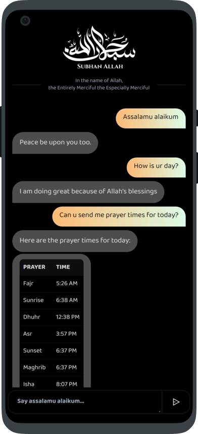

<a name="readme-top"></a>

<div align="center">

[![Contributors][contributors-shield]][contributors-url]
[![Forks][forks-shield]][forks-url]
[![Stargazers][stars-shield]][stars-url]
[![Issues][issues-shield]][issues-url]
[![MIT License][license-shield]][license-url]
[![LinkedIn][linkedin-shield]][linkedin-url]

</div>

<!-- PROJECT LOGO -->
<br />
<div align="center">
  <a href="https://github.com/Muhammed-Rahif/swadeeq">
    
  </a>

  <h3 align="center">Swadeeq - An AI chat friend to muslims</h3>

  <p align="center">
    Swadeeq is a chat bot, developed to help muslims to be consistent on deen.
    <br />
    <a href="https://github.com/Muhammed-Rahif/swadeeq/releases/"><strong>View the latest release »</strong></a>
    <br />
    <br />
    <a href="https://github.com/Muhammed-Rahif/swadeeq#readme">Screenshots</a>
    ·
    <a href="https://github.com/Muhammed-Rahif/swadeeq/issues/new/choose">Report Bug</a>
    ·
    <a href="https://github.com/Muhammed-Rahif/swadeeq/pulls">Request Feature</a>
  </p>
</div>

<!-- TABLE OF CONTENTS -->
<details>
  <summary>Table of Contents</summary>
  <ol>
    <li>
      <a href="#about-the-project">About The Project</a>
      <ul>
        <li><a href="#built-with">Built With</a></li>
      </ul>
    </li>
    <li>
      <a href="#getting-started">Getting Started</a>
      <ul>
        <li><a href="#useful-commands">Useful commands</a></li>
        <!-- <li><a href="#prerequisites">Prerequisites</a></li>
        <li><a href="#installation">Installation</a></li> -->
      </ul>
    </li>
    <!-- <li><a href="#usage">Usage</a></li>
    <li><a href="#roadmap">Roadmap</a></li> -->
    <li><a href="#contributing">Contributing</a></li>
    <li><a href="#license">License</a></li>
    <li><a href="#contact">Contact</a></li>
    <li><a href="#acknowledgments">Acknowledgments</a></li>
  </ol>
</details>

<!-- ABOUT THE PROJECT -->

## About The Project

<div align="center">
  
  
  
</div>

Swadeeq is a mobile app designed to help Muslims stay consistent in their faith and strengthen their spiritual connection with Allah. With its chatbot interface, users can easily ask the bot about prayer times for their location, Islamic rulings on various topics, and get inspired to pray on time. The app also includes styled replies from the chatbot, rich dark-themed UI, Islamic calendar response, automatic notifications on prayer, dhikr, sleep and wakeup times, replying with hadiths and surah ayahs, or surah info, and basic knowledge about Islam and tawheed.

Built with Ionic and Capacitor, Swadeeq provides a seamless user experience with fast load times and smooth navigation. Its beautiful DaisyUI Dark theme enhances the user experience while also making it easier to prioritize faith throughout the day. Whether you're a devout Muslim or just starting to learn about Islam, Swadeeq has something for everyone.

Features:-

- Get prayer times by location in chatbot
- Basic greetings for bot
- Basic conversation trained
- Ask bot about Islamic rulings on various topics
- Get inspired to pray on time
- Styled reply from chatbot
- Rich dark themed UI
- Islamic calendar response
- Notifications on prayer, dhikr, sleep and wakeup times
- Replying with hadiths and surah ayahs, or surah info
- Basic knowledge about Islam and Tawheed

<!-- Use the `BLANK_README.md` to get started. -->

<p align="right">(<a href="#readme-top">back to top</a>)</p>

### Built With

Major frameworks/libraries used to bootstrap the project.

- [![React][react.js]][react-url]
- [![Nlp.js][nlp.js]][nlp.js-url]
- [![Ionic][ionic]][ionic-url]
- [![Capacitor][capacitor]][capacitor-url]
- [![Tailwind CSS][tailwind-css]][tailwind-css-url]
- [![DaisyUi][daisyui]][daisyui-url]

Ui inspired from https://dribbble.com/shots/17114459-Chatbot-your-personal-shopping-assistant

<!-- https://cdn.dribbble.com/users/1147769/screenshots/17114459/media/e6719b6d98776cc75adcfcfb6812277d.png -->

<p align="right">(<a href="#readme-top">back to top</a>)</p>

<!-- GETTING STARTED -->

## Getting Started

1. First, ensure you have [Yarn](https://yarnpkg.com/) installed on your machine.
2. Install the `@ionic/cli` and `@capacitor/cli` globally by running `yarn global add @ionic/cli @capacitor/cli` in your terminal or command prompt.
3. Clone this repository to your local machine using `git clone https://github.com/Muhammed-Rahif/swadeeq.git`.
4. Navigate to the project directory using your terminal or command prompt.
5. Run `yarn install` to install all necessary dependencies.
6. To launch the app on your local machine, run `ionic serve`.
7. Once the app is running, you can access it by navigating to `http://localhost:8100` in your web browser.

And that's it! You should now have a local copy of Swadeeq running on your machine. If you encounter any issues, please refer to the project's documentation or reach out to our support team for assistance.

### Useful commands

```bash
# build command for dubug
ionic capacitor copy android && cd android && gradlew assembleDebug && cd ..

# build command for release
ionic capacitor copy android && cd android && gradlew assembleRelease && cd ..

# install to external device directly dubug version
ionic capacitor copy android && cd android && gradlew assembleDebug && gradlew installDebug && cd ..

# android external device run
ionic capacitor run android -l --watch --external
```

<!-- ## Usage

Use this space to show useful examples of how a project can be used. Additional screenshots, code examples and demos work well in this space. You may also link to more resources.

_For more examples, please refer to the [Documentation](https://example.com)_

<p align="right">(<a href="#readme-top">back to top</a>)</p> -->

<!-- ROADMAP -->

<!-- ## Roadmap

- [x] Add Changelog
- [x] Add back to top links
- [ ] Add Additional Templates w/ Examples
- [ ] Add "components" document to easily copy & paste sections of the readme
- [ ] Multi-language Support
  - [ ] Chinese
  - [ ] Spanish

See the [open issues](https://github.com/Muhammed-Rahif/swadeeq/issues) for a full list of proposed features (and known issues).

<p align="right">(<a href="#readme-top">back to top</a>)</p> -->

<!-- CONTRIBUTING -->

## Contributing

With 'swadeeq' app, I believe that contributing to an app that benefits the Ummah is a way to earn rewards from Allah SWT. That's why I've created an app that helps Muslims on their journey towards spiritual growth and consistency in practicing their faith. By building and contributing to 'swadeeq', you have the opportunity to earn rewards from Allah SWT and be a part of a community-driven effort to empower Muslims to achieve their spiritual goals. Whether you're a developer, a designer, or just someone with an idea, your contribution can help make a difference. So, join us in this journey and contribute for the sake of Allah. Together, we can create valuable tools that benefit the Ummah and earn rewards in this life and the hereafter.

If you have a suggestion that would make this better, please fork the repo and create a pull request. You can also simply open an issue with the tag "enhancement".

1. Fork the Project
2. Create your Feature Branch (`git checkout -b feature/AmazingFeature`)
3. Commit your Changes (`git commit -m 'Add some AmazingFeature'`)
4. Push to the Branch (`git push origin feature/AmazingFeature`)
5. Open a Pull Request

<p align="right">(<a href="#readme-top">back to top</a>)</p>

<!-- LICENSE -->

## License

Distributed under the MIT License. See `LICENSE.txt` for more information.

<p align="right">(<a href="#readme-top">back to top</a>)</p>

<!-- CONTACT -->

## Contact

Muhammed Rahif - [@Muhammed_Rahif](https://twitter.com/Muhammed_Rahif) - rahifpalliyalil@gmail.com

Project Link: [https://github.com/Muhammed-Rahif/swadeeq](https://github.com/Muhammed-Rahif/swadeeq)

<p align="right">(<a href="#readme-top">back to top</a>)</p>

<!-- ACKNOWLEDGMENTS -->

## Acknowledgments

Use this space to list resources you find helpful and would like to give credit to. I've included a few of my favorites to kick things off!

- [React App Rewired](https://github.com/timarney/react-app-rewired)
- [Tailwindcss Typography-plugin](https://tailwindcss.com/docs/typography-plugin)
- [React Icons](https://react-icons.github.io/react-icons/search)
- [DayJs](https://day.js.org/)
- [AxiosJs](https://axios-http.com/docs/intro)
- [Framer Motion](https://www.framer.com/motion/)
- [React Markdown](https://remarkjs.github.io/react-markdown/)
- [PostCSS](https://postcss.org/)
- [Typescript](https://www.typescriptlang.org/)
- [Img Shields](https://shields.io)
- [Choose an Open Source License](https://choosealicense.com)

<p align="right">(<a href="#readme-top">back to top</a>)</p>

<!-- MARKDOWN LINKS & IMAGES -->
<!-- https://www.markdownguide.org/basic-syntax/#reference-style-links -->

[contributors-shield]: https://img.shields.io/github/contributors/Muhammed-Rahif/swadeeq.svg?style=for-the-badge
[contributors-url]: https://github.com/Muhammed-Rahif/swadeeq/graphs/contributors
[forks-shield]: https://img.shields.io/github/forks/Muhammed-Rahif/swadeeq.svg?style=for-the-badge
[forks-url]: https://github.com/Muhammed-Rahif/swadeeq/network/members
[stars-shield]: https://img.shields.io/github/stars/Muhammed-Rahif/swadeeq.svg?style=for-the-badge
[stars-url]: https://github.com/Muhammed-Rahif/swadeeq/stargazers
[issues-shield]: https://img.shields.io/github/issues/Muhammed-Rahif/swadeeq.svg?style=for-the-badge
[issues-url]: https://github.com/Muhammed-Rahif/swadeeq/issues
[license-shield]: https://img.shields.io/github/license/Muhammed-Rahif/swadeeq.svg?style=for-the-badge
[license-url]: https://github.com/Muhammed-Rahif/swadeeq/blob/master/LICENSE.txt
[linkedin-shield]: https://img.shields.io/badge/-LinkedIn-black.svg?style=for-the-badge&logo=linkedin&colorB=555
[linkedin-url]: https://linkedin.com/in/othneildrew
[product-screenshot]: resources/splash.png
[nlp.js]: https://img.shields.io/badge/nlp.js-000000?style=for-the-badge&logoColor=white
[nlp.js-url]: https://github.com/axa-group/nlp.js/
[react.js]: https://img.shields.io/badge/React-20232A?style=for-the-badge&logo=react&logoColor=61DAFB
[react-url]: https://reactjs.org/
[ionic]: https://img.shields.io/badge/Ionic-3880FF?style=for-the-badge&logoColor=white&logo=ionic
[ionic-url]: https://ionic.io/
[capacitor]: https://img.shields.io/badge/Capacitor-119EFF?style=for-the-badge&logoColor=white&logo=capacitor
[capacitor-url]: https://capacitorjs.com/
[daisyui]: https://img.shields.io/badge/DaisyUI-5A0EF8?style=for-the-badge&logoColor=white&logo=daisyui
[daisyui-url]: https://daisyui.com/
[tailwind-css]: https://img.shields.io/badge/Tailwind%20CSS-06B6D4?style=for-the-badge&logo=tailwind-css&logoColor=white
[tailwind-css-url]: https://tailwindcss.com/
[bootstrap.com]: https://img.shields.io/badge/Bootstrap-563D7C?style=for-the-badge&logo=bootstrap&logoColor=white
[bootstrap-url]: https://getbootstrap.com
[jquery.com]: https://img.shields.io/badge/jQuery-0769AD?style=for-the-badge&logo=jquery&logoColor=white
[jquery-url]: https://jquery.com
